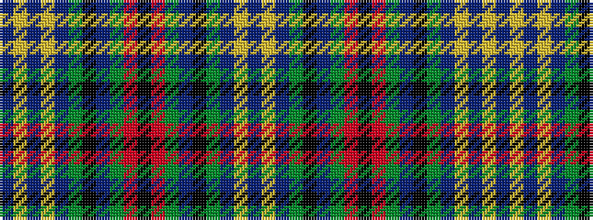

BYBGKBGRKRGBKGBYBYB

It is a 19 stripe tartan.

<figure class="pat-woven">

<figcaption>idealised sample</figcaption>
</figure>

## Colour Sequence



## Tartans with this colour sequence

| Tartans |
|---------------|
| [Pennsylvania (District)](/variants/s19/dt30ly2dt2ly2dt5g5k15dt5g20r2k3r2g20dt5k15g5dt20ly2dt2~x2/)|
||
