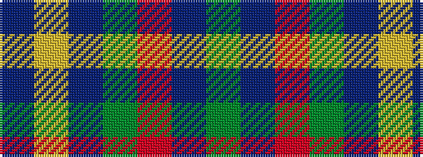

BYBGRBG

It is a 7 stripe tartan.

<figure class="pat-woven">

<figcaption>idealised sample</figcaption>
</figure>

## Colour Sequence



## Tartans with this colour sequence

| Tartans |
|---------------|
| [Crieff & Strathearn #1](/variants/s7/g55db7r24g12dt4ly3dt4~x2/)|
||
| [Crieff and Strathearn District Tartan](/variants/s7/g55dp7r24g12db4ly3db4~x2/)|
||
| [Crieff, and Strathearn](/variants/s7/g55p7r24g12db4ly3db4~x2/)|
||
| [Unnamed C20th - USA](/variants/s7/db2ly1db18g7r7db1g1~x2/)|
||
