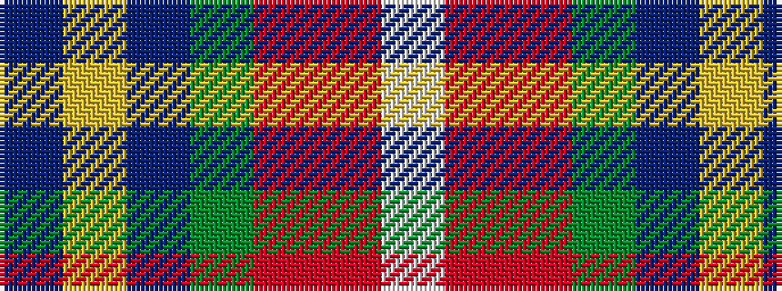

BYBGRRW

It is a 7 stripe tartan.

<figure class="pat-woven">

<figcaption>idealised sample</figcaption>
</figure>

## Colour Sequence



## Tartans with this colour sequence

| Tartans |
|---------------|
| [Hier (Personal)](/setts/s7/t58ly2db24g2r1r5w1~x2/)|
||
