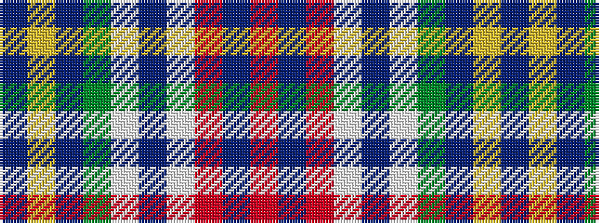

BYBGWBWRBR

It is a 10 stripe tartan.

<figure class="pat-woven">

<figcaption>idealised sample</figcaption>
</figure>

## Colour Sequence



## Tartans with this colour sequence

| Tartans |
|---------------|
| [Asman Family](/variants/s10/db4ly3db17g6w2dr6w2r24dr3r4~x2/)|
||
