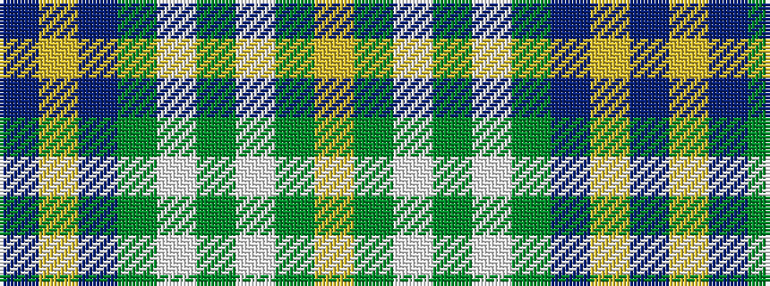

BYBGWGWGY

It is a 9 stripe tartan.

<figure class="pat-woven">

<figcaption>idealised sample</figcaption>
</figure>

## Colour Sequence



## Tartans with this colour sequence

| Tartans |
|---------------|
| [MacOrrell](/variants/s9/db10ly4db36g28w3g3w3g8ly6/)|
||
| [MacOrrell](/variants/s9/db5ly2db17g14w1g1w1g4ly2~x2/)|
||
