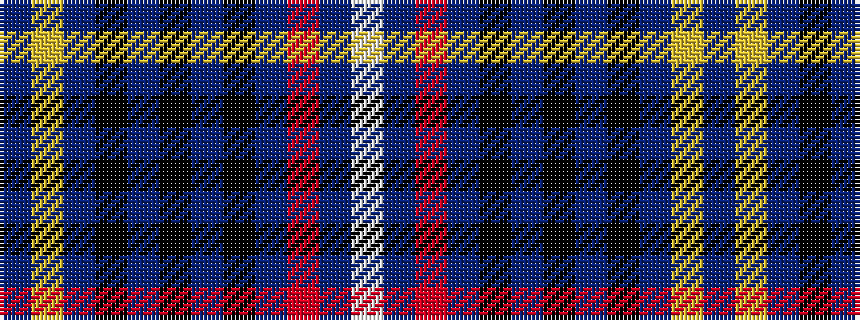

BYBKBKBKBRBW

It is a 12 stripe tartan.

<figure class="pat-woven">

<figcaption>idealised sample</figcaption>
</figure>

## Colour Sequence



## Tartans with this colour sequence

| Tartans |
|---------------|
| [Orr Senior, Gerald William](/setts/s12/n4ly2n2k5n4k4n8k6n2r32n2w4~x2/)|
||
| [Orr, Gerald William (Personal)](/setts/s12/n4lo2n2k5n4k4n8k6n2r32n2w4~x2/)|
||
