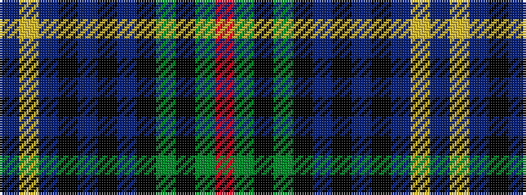

BYBKBKBKGKGR

It is a 12 stripe tartan.

<figure class="pat-woven">

<figcaption>idealised sample</figcaption>
</figure>

## Colour Sequence



## Tartans with this colour sequence

| Tartans |
|---------------|
| [Urquhart](/setts/s12/db4lr2db24k3db3k3db8k24dg48k3dg3r2~x2/)|
||
| [Urquhart](/setts/s12/db4lr2db24k3db3k3db8k24dg48k3dg3r2/)|
||
