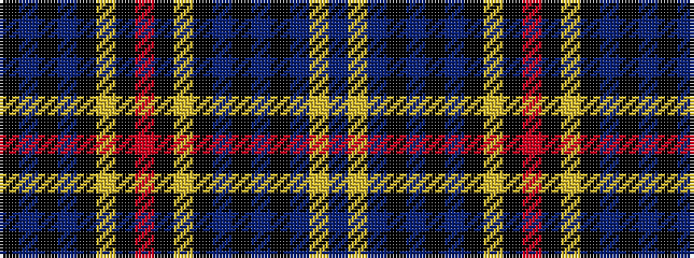

BYBKBKBKYKRKYKBKBK

It is a 18 stripe tartan.

<figure class="pat-woven">

<figcaption>idealised sample</figcaption>
</figure>

## Colour Sequence



## Tartans with this colour sequence

| Tartans |
|---------------|
| [Cleikum](/setts/s18/db28ly3db28k2db2k2db3k34ly2k3r3k3ly2k34db3k2db2k2~x2/)|
||
