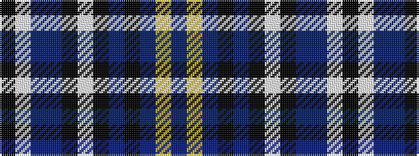

BYBKBKWKBBWK

It is a 12 stripe tartan.

<figure class="pat-woven">

<figcaption>idealised sample</figcaption>
</figure>

## Colour Sequence



## Tartans with this colour sequence

| Tartans |
|---------------|
| [Covington, Christopher (Personal)](/variants/s12/k33w3b2db7k2w3k5b21k15b1lg18b1~x2/)|
||
