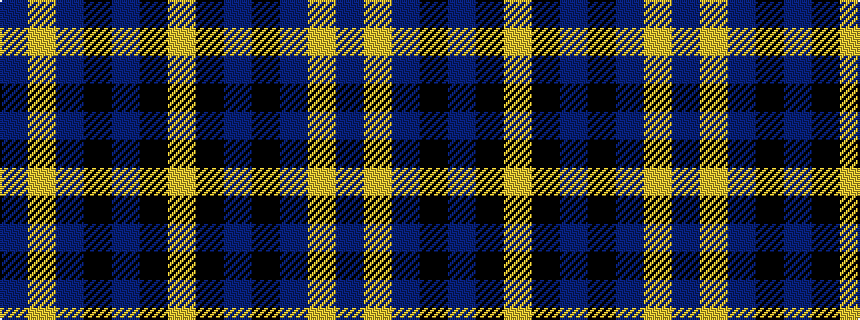

BYBKBKY

It is a 7 stripe tartan.

<figure class="pat-woven">

<figcaption>idealised sample</figcaption>
</figure>

## Colour Sequence



## Tartans with this colour sequence

| Tartans |
|---------------|
| [Grange School](/variants/s7/n27lr3n14k3n13k3ly23~x2/)|
||
