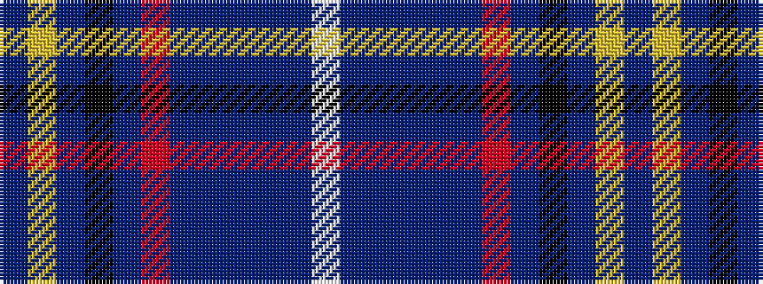

BYBKBRBBBBBW

It is a 12 stripe tartan.

<figure class="pat-woven">

<figcaption>idealised sample</figcaption>
</figure>

## Colour Sequence



## Tartans with this colour sequence

| Tartans |
|---------------|
| [Edinburgh Bus Tours](/setts/s12/w6dt20b5dt5b5dt20r14dt4k18dt30lo4dt4/)|
||
