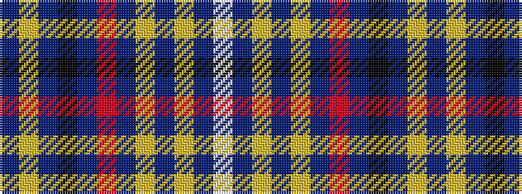

BYBKBRBYBYBW

It is a 12 stripe tartan.

<figure class="pat-woven">

<figcaption>idealised sample</figcaption>
</figure>

## Colour Sequence



## Tartans with this colour sequence

| Tartans |
|---------------|
| [Edinburgh Bus Tours](/setts/s12/lb6db20lg5db5lg5db20r14db4k18db30ly4db4/)|
||
