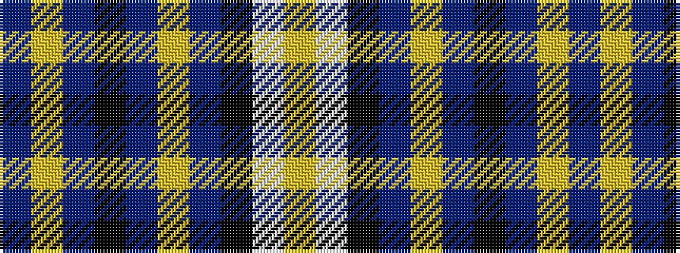

BYBKBYBKWY

It is a 10 stripe tartan.

<figure class="pat-woven">

<figcaption>idealised sample</figcaption>
</figure>

## Colour Sequence



## Tartans with this colour sequence

| Tartans |
|---------------|
| [Kyle, Grape (Dance)](/variants/s10/dp17lg1dp2k2dp2lg1dp3k8w17lg2~x4/)|
||
