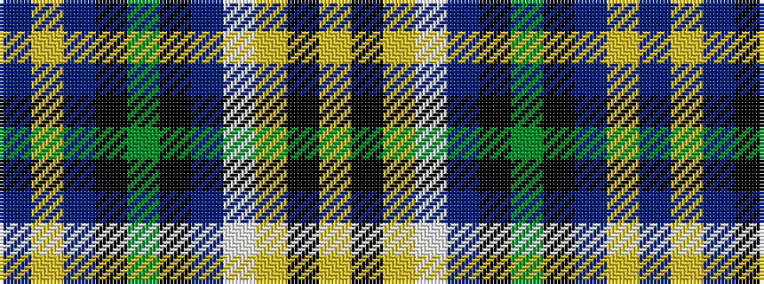

BYBKGKBWYKY

It is a 11 stripe tartan.

<figure class="pat-woven">

<figcaption>idealised sample</figcaption>
</figure>

## Colour Sequence



## Tartans with this colour sequence

| Tartans |
|---------------|
| [Aurora House Check](/setts/s11/db40lg3db11k7g22k7db3w3lr10k32ly13~x2/)|
||
