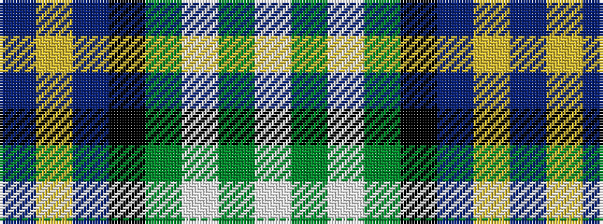

BYBKGWGW

It is a 8 stripe tartan.

<figure class="pat-woven">

<figcaption>idealised sample</figcaption>
</figure>

## Colour Sequence



## Tartans with this colour sequence

| Tartans |
|---------------|
| [Business Air](/setts/s8/db4lg2db10k12dg10lb3dg2lb4~x2/)|
||
