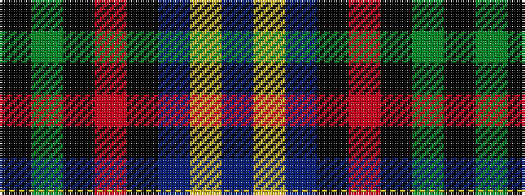

BYBKRKGK

It is a 8 stripe tartan.

<figure class="pat-woven">

<figcaption>idealised sample</figcaption>
</figure>

## Colour Sequence



## Tartans with this colour sequence

| Tartans |
|---------------|
| [Kilgour (Cant)](/variants/s8/db6ly1db6k3r14k3g14k3~x4/)|
||
