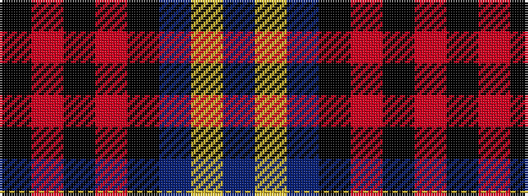

BYBKRKRK

It is a 8 stripe tartan.

<figure class="pat-woven">

<figcaption>idealised sample</figcaption>
</figure>

## Colour Sequence



## Tartans with this colour sequence

| Tartans |
|---------------|
| [Rutherford](/setts/s8/k8r1k1r1k4b11ly1b2~x6/)|
||
