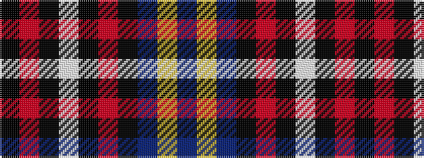

BYBKRKWKRK

It is a 10 stripe tartan.

<figure class="pat-woven">

<figcaption>idealised sample</figcaption>
</figure>

## Colour Sequence



## Tartans with this colour sequence

| Tartans |
|---------------|
| [Soroptimist International](/setts/s10/b12lo2b12k6m10k1w2k1m10k6~x2/)|
||
