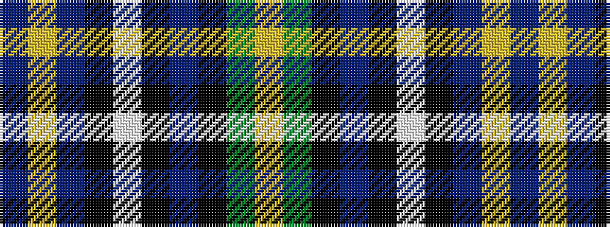

BYBKWKBKGY

It is a 10 stripe tartan.

<figure class="pat-woven">

<figcaption>idealised sample</figcaption>
</figure>

## Colour Sequence



## Tartans with this colour sequence

| Tartans |
|---------------|
| [Wcwm 9275-1510-5](/setts/s10/dp60lo2dp10k9lb2k2b2k2y28lo3~x2/)|
||
