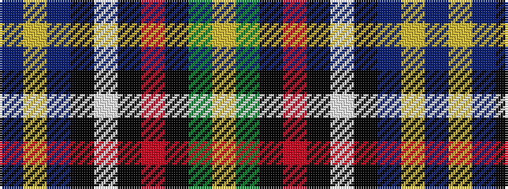

BYBKWKRKGY

It is a 10 stripe tartan.

<figure class="pat-woven">

<figcaption>idealised sample</figcaption>
</figure>

## Colour Sequence



## Tartans with this colour sequence

| Tartans |
|---------------|
| [Wcwm 9275-1510-1](/setts/s10/db60lo2db10k9lb2k2r2k2g28lo3~x2/)|
||
