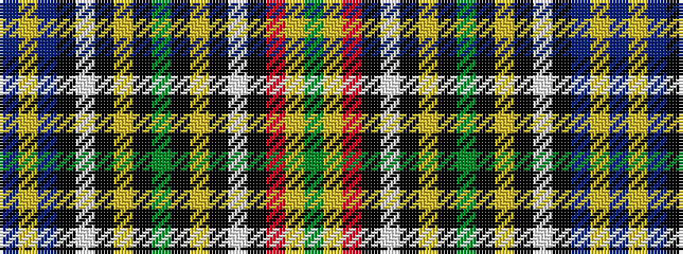

BYBKWKYKGKYKWKRYG

It is a 17 stripe tartan.

<figure class="pat-woven">

<figcaption>idealised sample</figcaption>
</figure>

## Colour Sequence



## Tartans with this colour sequence

| Tartans |
|---------------|
| [Total](/setts/s17/dt48lo4dt28k5w4k6lo4k7g8k7lo4k6w4k5r24lo4g48/)|
||
