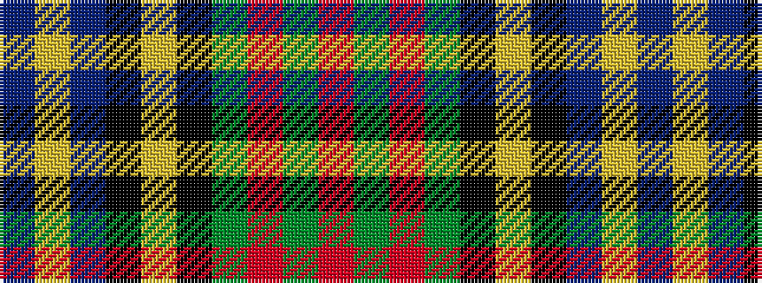

BYBKYKGRGR

It is a 10 stripe tartan.

<figure class="pat-woven">

<figcaption>idealised sample</figcaption>
</figure>

## Colour Sequence



## Tartans with this colour sequence

| Tartans |
|---------------|
| [MacMillan Hunting](/tartans/db3ly1db12k4ly2k4dg8r2dg8r1/)|
||
| [MacMillan Hunting Clan Tartan Tartan Number: 668. Earliest known date: 1906 The Setts No: 160. W & A K Johnston See products available Copyright © Blair Urquhart, Comrie, 2015](/setts/s10/db6ly2db18k6ly3k6g14r3g10r2~x2/)|
||
| [MacMillan, hunting](/setts/s10/db3ly1db12k4ly2k4g8r2g8r1~x2/)|
||
