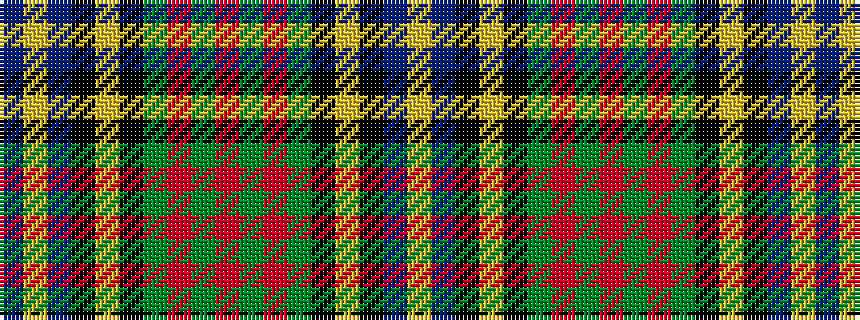

BYBKYKGRGRGRGKYKBY

It is a 18 stripe tartan.

<figure class="pat-woven">

<figcaption>idealised sample</figcaption>
</figure>

## Colour Sequence



## Tartans with this colour sequence

| Tartans |
|---------------|
| [MacMillan Hunting #2](/variants/s18/db3ly1db12k4ly2k4dg8r2dg8r1~x4/)|
||
