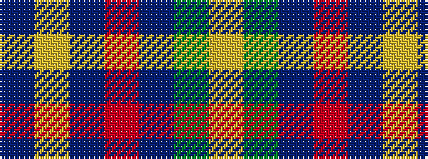

BYBRBGY

It is a 7 stripe tartan.

<figure class="pat-woven">

<figcaption>idealised sample</figcaption>
</figure>

## Colour Sequence



## Tartans with this colour sequence

| Tartans |
|---------------|
| [Hill of Banchory Primary (School)](/variants/s7/db1ly6db8r1db8g6ly1~x4/)|
||
