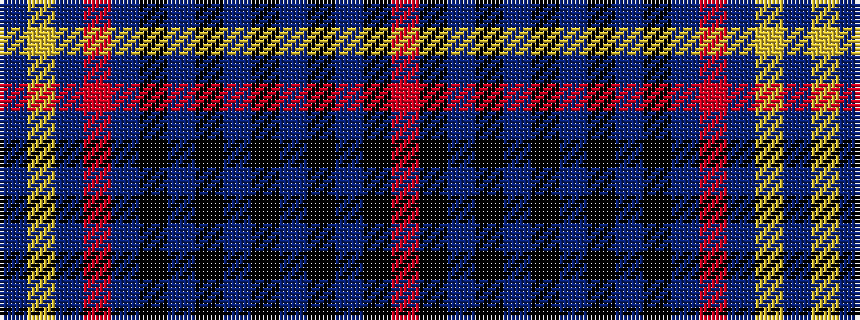

BYBRBKBKBKBKBKR

It is a 15 stripe tartan.

<figure class="pat-woven">

<figcaption>idealised sample</figcaption>
</figure>

## Colour Sequence



## Tartans with this colour sequence

| Tartans |
|---------------|
| [Bamcroft (Corporate)](/setts/s15/dbi11ly2dbi2r2dbi2k11db11k2db3k2db11k11dbi11k2r3~x2/)|
||
