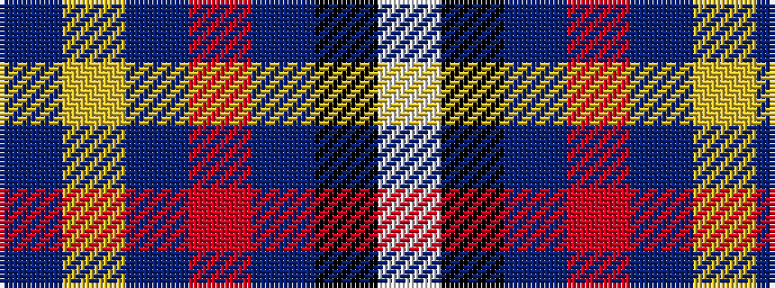

BYBRBKW

It is a 7 stripe tartan.

<figure class="pat-woven">

<figcaption>idealised sample</figcaption>
</figure>

## Colour Sequence



## Tartans with this colour sequence

| Tartans |
|---------------|
| [Mensa](/variants/s7/lb3k19db24r2db2ly2db2~x2/)|
||
