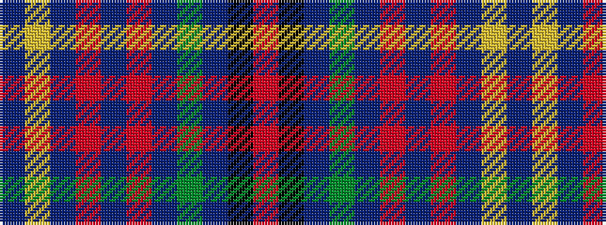

BYBRBRBGBKR

It is a 11 stripe tartan.

<figure class="pat-woven">

<figcaption>idealised sample</figcaption>
</figure>

## Colour Sequence



## Tartans with this colour sequence

| Tartans |
|---------------|
| [Rabbie Burns](/variants/s11/db4ly2db5r11db4r2db2g10db28k1r2~x2/)|
||
