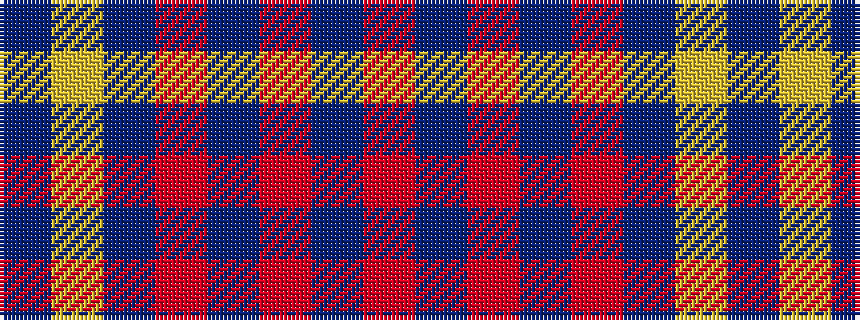

BYBRBRBR

It is a 8 stripe tartan.

<figure class="pat-woven">

<figcaption>idealised sample</figcaption>
</figure>

## Colour Sequence



## Tartans with this colour sequence

| Tartans |
|---------------|
| [Turnberry (MacArthur)](/setts/s8/o24n3o3n3o3n20lr22n4~x2/)|
||
