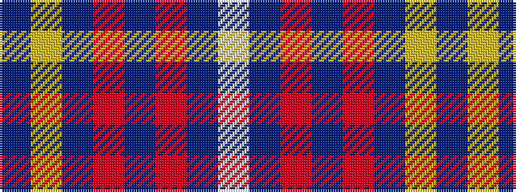

BYBRBRBW

It is a 8 stripe tartan.

<figure class="pat-woven">

<figcaption>idealised sample</figcaption>
</figure>

## Colour Sequence



## Tartans with this colour sequence

| Tartans |
|---------------|
| [Brigadoon](/variants/s8/w4db19r4dp2r4dp23ly4dp2~x2/)|
||
