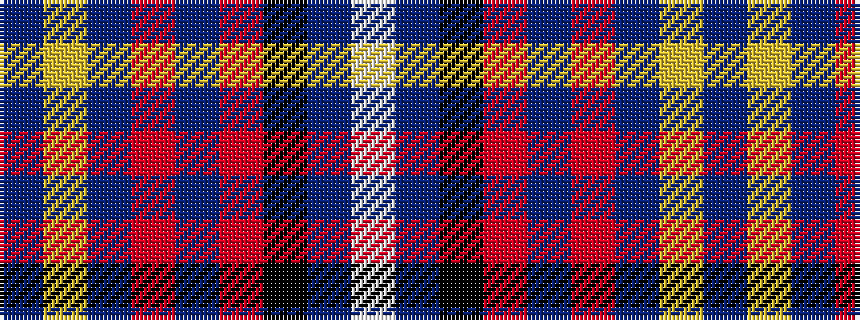

BYBRBRKBW

It is a 9 stripe tartan.

<figure class="pat-woven">

<figcaption>idealised sample</figcaption>
</figure>

## Colour Sequence



## Tartans with this colour sequence

| Tartans |
|---------------|
| [Turnberry](/setts/s9/n14lg3n2o8n5o2k2n25lb2~x2/)|
||
