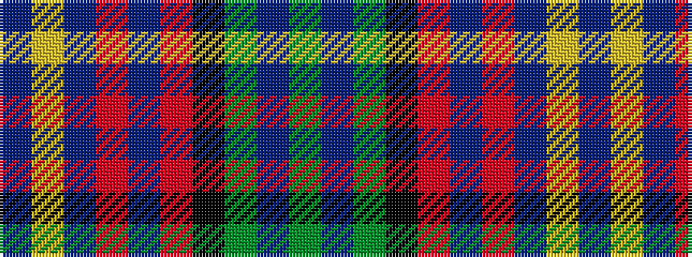

BYBRBRKGBG

It is a 10 stripe tartan.

<figure class="pat-woven">

<figcaption>idealised sample</figcaption>
</figure>

## Colour Sequence



## Tartans with this colour sequence

| Tartans |
|---------------|
| [Nance (1998)](/variants/s10/db2lo1db6r1db2r2k2g6t1g2~x4/)|
||
