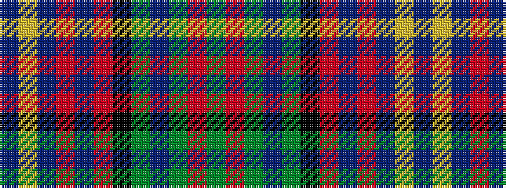

BYBRBRKGBGRG

It is a 12 stripe tartan.

<figure class="pat-woven">

<figcaption>idealised sample</figcaption>
</figure>

## Colour Sequence



## Tartans with this colour sequence

| Tartans |
|---------------|
| [West Highland Way (Corporate)](/setts/s12/db7lr1db1r2db9r1k9g13dp2g18r1g6~x2/)|
||
