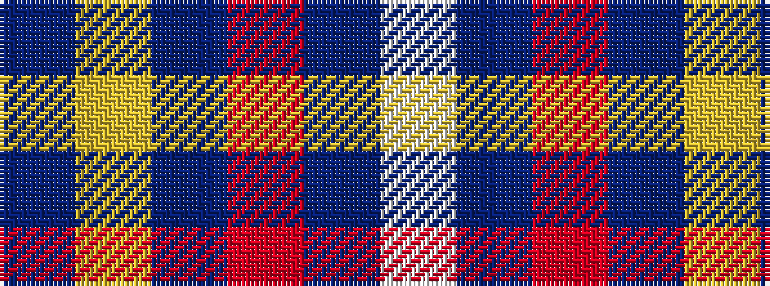

BYBRBW

It is a 6 stripe tartan.

<figure class="pat-woven">

<figcaption>idealised sample</figcaption>
</figure>

## Colour Sequence



## Tartans with this colour sequence

| Tartans |
|---------------|
| [East of Scotland Tartan Army](/setts/s6/dt40ly10dt8r20dt100w5/)|
||
