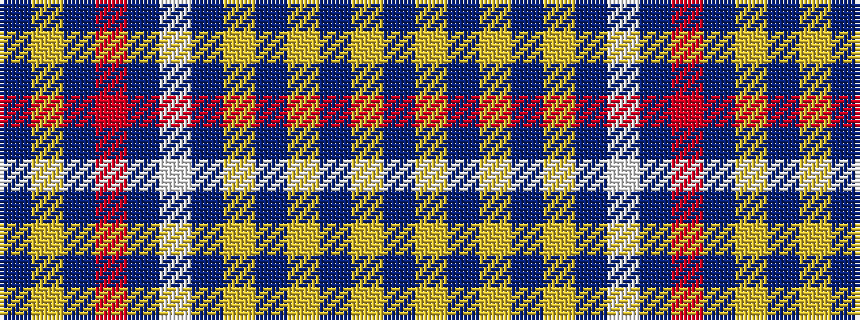

BYBRBWBYBYBYB

It is a 13 stripe tartan.

<figure class="pat-woven">

<figcaption>idealised sample</figcaption>
</figure>

## Colour Sequence



## Tartans with this colour sequence

| Tartans |
|---------------|
| [Clydesdale Bank](/variants/s13/n27lr3n28lr3n28lr3n31w2n31r36n20lr3n1~x2/)|
||
