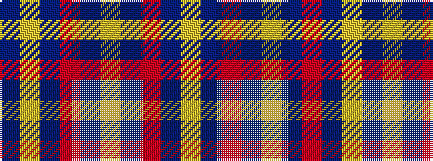

BYBRBYBRBY

It is a 10 stripe tartan.

<figure class="pat-woven">

<figcaption>idealised sample</figcaption>
</figure>

## Colour Sequence



## Tartans with this colour sequence

| Tartans |
|---------------|
| [South Australian Pipes & Drums](/setts/s10/db60ly6db11r25db11ly6~x2/)|
||
