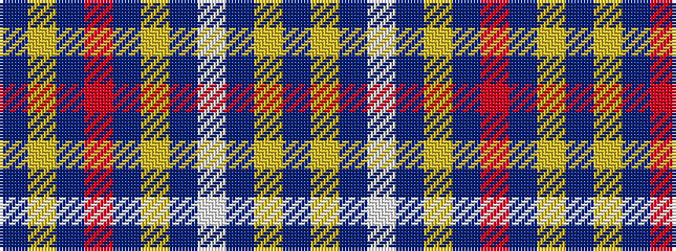

BYBRBYBWBYB

It is a 11 stripe tartan.

<figure class="pat-woven">

<figcaption>idealised sample</figcaption>
</figure>

## Colour Sequence



## Tartans with this colour sequence

| Tartans |
|---------------|
| [Rogue Attitude](/setts/s11/dt31lr4n2r2n2lr6n2w4n2lr8dt2~x2/)|
||
