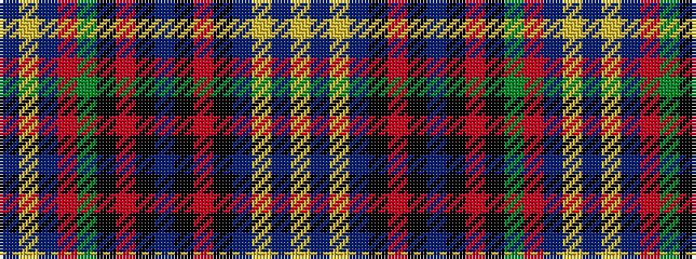

BYBRGKRKBKRKBYBY

It is a 16 stripe tartan.

<figure class="pat-woven">

<figcaption>idealised sample</figcaption>
</figure>

## Colour Sequence



## Tartans with this colour sequence

| Tartans |
|---------------|
| [Tartan de Longueuil](/variants/s16/ly4db3ly2db2k1r1k1db7k1r1k1g10r1db3ly1db3~x2/)|
||
