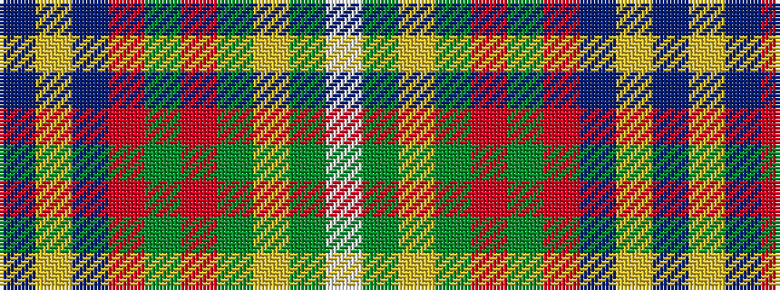

BYBRGRGYGW

It is a 10 stripe tartan.

<figure class="pat-woven">

<figcaption>idealised sample</figcaption>
</figure>

## Colour Sequence



## Tartans with this colour sequence

| Tartans |
|---------------|
| [Cornell (Fashion)](/variants/s10/w50g5ly2g5r2g20r2db5ly2db40~x2/)|
||
