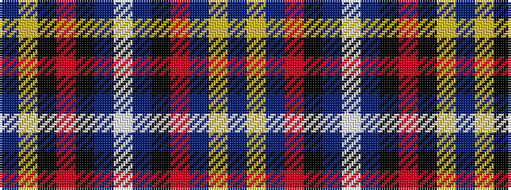

BYBRKBWBKRKYB

It is a 13 stripe tartan.

<figure class="pat-woven">

<figcaption>idealised sample</figcaption>
</figure>

## Colour Sequence



## Tartans with this colour sequence

| Tartans |
|---------------|
| [European Congress of Immunology 2012](/setts/s13/p13ly2k18r22k28b6w2b6k28r22b18ly2p13/)|
||
