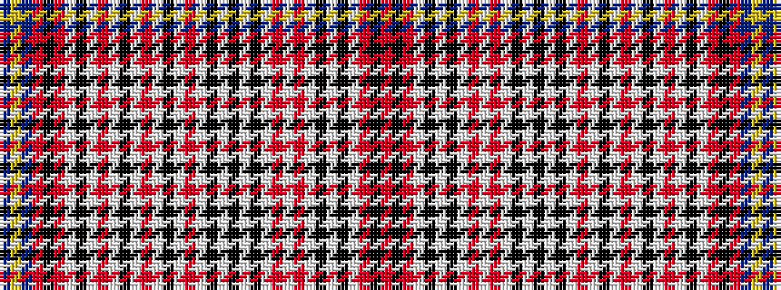

BYBRKRWKWRWKWRWKWRWKWKWKWRWRWKWKWRKR

It is a 36 stripe tartan.

<figure class="pat-woven">

<figcaption>idealised sample</figcaption>
</figure>

## Colour Sequence



## Tartans with this colour sequence

| Tartans |
|---------------|
| [Debian](/setts/s36/db7ly1db7m7k1m7w1k1w3r3w3k1w1r3w1k1w1r3w1k1w1k1w1k1w3r3w1r3w1k1w1k1w3m7k1m7~x4/)|
||
