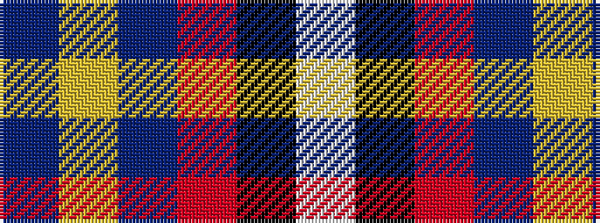

BYBRKW

It is a 6 stripe tartan.

<figure class="pat-woven">

<figcaption>idealised sample</figcaption>
</figure>

## Colour Sequence



## Tartans with this colour sequence

| Tartans |
|---------------|
| [Wylie](/variants/s6/db45ly3db10o4k1w2~x2/)|
||
| [Wylie (Ancient)](/variants/s6/b86ly2b18r3k1w2~x2/)|
||
| [Wylie (Name)](/variants/s6/n45ly3n10o4k1w2~x4/)|
||
