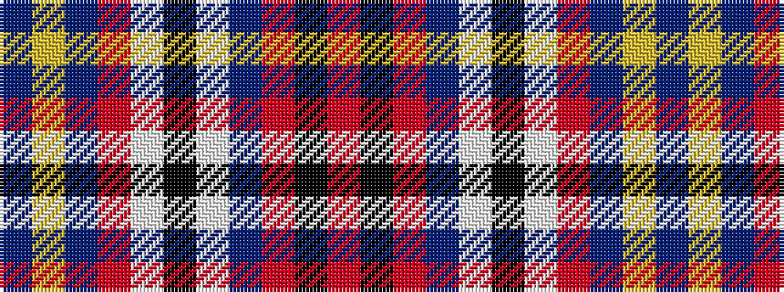

BYBRWKWBRKR

It is a 11 stripe tartan.

<figure class="pat-woven">

<figcaption>idealised sample</figcaption>
</figure>

## Colour Sequence



## Tartans with this colour sequence

| Tartans |
|---------------|
| [Asman Hunting (Name)](/variants/s11/db4ly3db22r6w2k6w2db6o20k3o4~x2/)|
||
