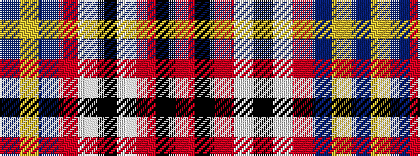

BYBRWKWRKR

It is a 10 stripe tartan.

<figure class="pat-woven">

<figcaption>idealised sample</figcaption>
</figure>

## Colour Sequence



## Tartans with this colour sequence

| Tartans |
|---------------|
| [Asman Red (Personal)](/setts/s10/db4ly3db22o6w2k6w2r26k3r4~x2/)|
||
