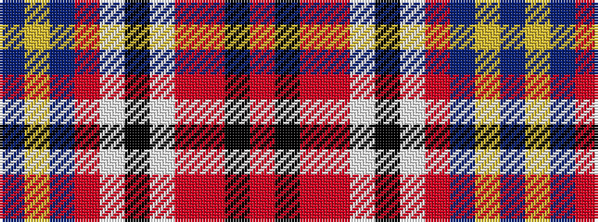

BYBRWKWRRKR

It is a 11 stripe tartan.

<figure class="pat-woven">

<figcaption>idealised sample</figcaption>
</figure>

## Colour Sequence



## Tartans with this colour sequence

| Tartans |
|---------------|
| [Asman Dress Family Tartan Tartan Number: 2552. Earliest known date: 1989 Designed for David I Asman by Dr. Philip D. Smith, 1989. David Asman was an English armiger and lived at one time in New jersey, USA. The tartan was first woven by Peter MacDonald in the weaving shed at the Scottish Tartan Society's Comrie museum in the 1989. See products available Copyright © Blair Urquhart, Comrie, 2015](/setts/s11/db4ly3db22o6w2k6w2r6r20k3r4~x2/)|
||
