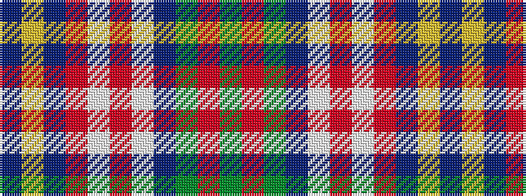

BYBRWRWBGRG

It is a 11 stripe tartan.

<figure class="pat-woven">

<figcaption>idealised sample</figcaption>
</figure>

## Colour Sequence



## Tartans with this colour sequence

| Tartans |
|---------------|
| [Asman Hunting](/variants/s11/db4ly3db17r7w2o7w2db7g17o3g4~x2/)|
||
