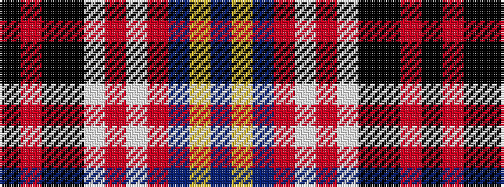

BYBRWRWKKRK

It is a 11 stripe tartan.

<figure class="pat-woven">

<figcaption>idealised sample</figcaption>
</figure>

## Colour Sequence



## Tartans with this colour sequence

| Tartans |
|---------------|
| [Asman, Dress (Name)](/variants/s11/k4r3k20k6w2r6w2o6db22ly3db4~x2/)|
||
