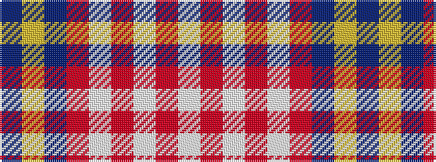

BYBRWRWRW

It is a 9 stripe tartan.

<figure class="pat-woven">

<figcaption>idealised sample</figcaption>
</figure>

## Colour Sequence



## Tartans with this colour sequence

| Tartans |
|---------------|
| [Sea Dog Bamse, Pride of Norway](/variants/s9/dt3lo2dt32r28w2r2w2r2w3~x2/)|
||
