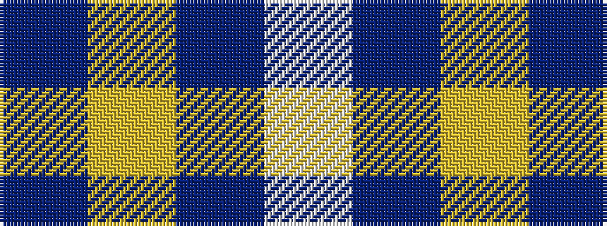

BYBW

It is a 4 stripe tartan.

<figure class="pat-woven">

<figcaption>idealised sample</figcaption>
</figure>

## Colour Sequence



## Tartans with this colour sequence

| Tartans |
|---------------|
| [Lucard, Stéphane (Personal)](/setts/s4/w11t20lo3t8~x2/)|
||
| [Westfield (Corporate?)](/setts/s4/dt102lr11dt14w11/)|
||
