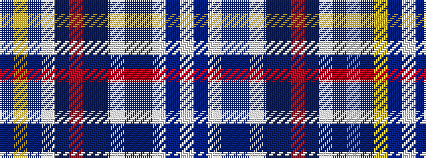

BYBWBRBBWBBWBW

It is a 14 stripe tartan.

<figure class="pat-woven">

<figcaption>idealised sample</figcaption>
</figure>

## Colour Sequence



## Tartans with this colour sequence

| Tartans |
|---------------|
| [MacHinery Dress (Fashion)](/setts/s14/t6ly2t24w4t4r2db16t20w4t20db16w16db3w4~x2/)|
||
