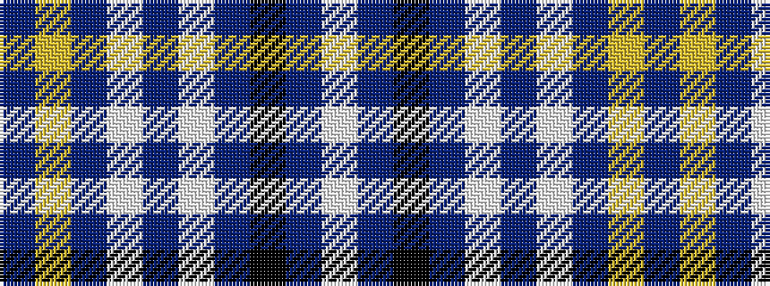

BYBWBWBKBW

It is a 10 stripe tartan.

<figure class="pat-woven">

<figcaption>idealised sample</figcaption>
</figure>

## Colour Sequence



## Tartans with this colour sequence

| Tartans |
|---------------|
| [London Fog Blue 2 (Fashion)](/variants/s10/t18lr9t18lb2t2lb2t18k9t18lb2/)|
||
